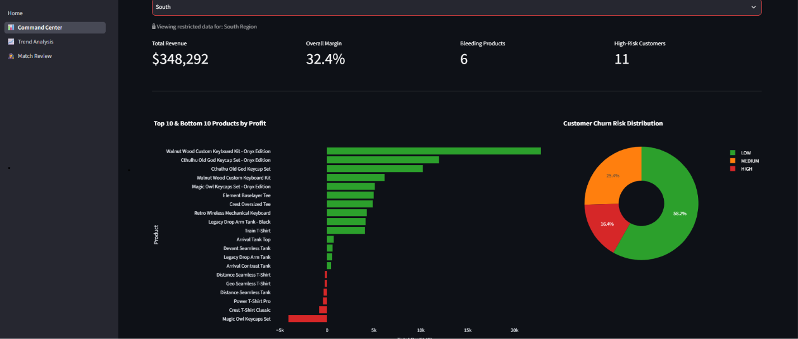
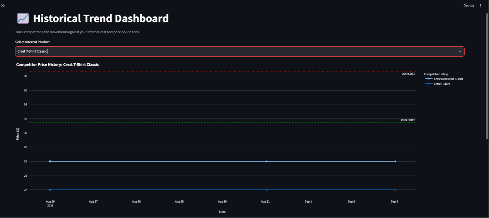

## Title: E-Commerce Margin & Intelligence Tracker

### Description:
A production-grade analytics engine that tracks competitor pricing trends, calculates true profit margins, and predicts customer churn using machine learning.

## 🎥 Demo & Screenshots

